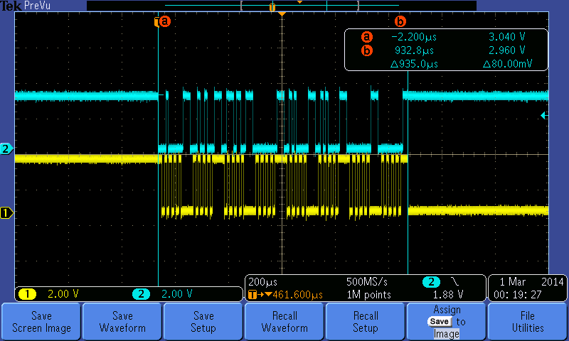
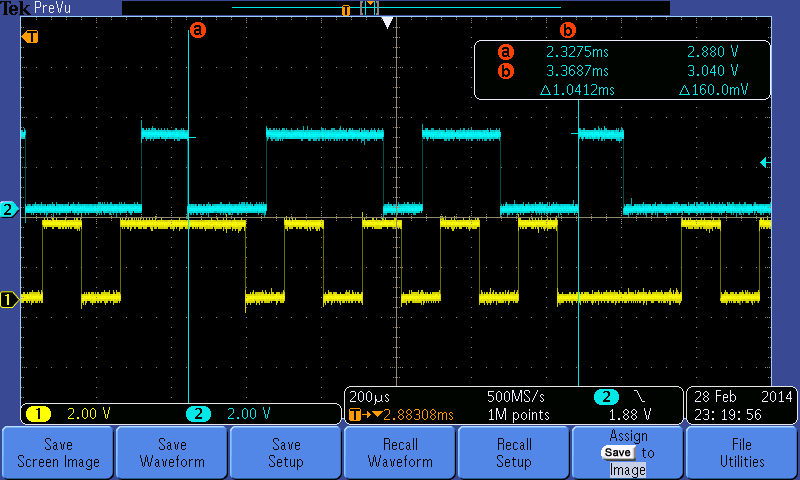

# LaTeX UART Comm RTISNL Report 
A report detailing my investigation and solution to comm issues between two embedded devices for the NAU real-time intelligent systems and networks laboratory

## Main board to daughter board communication timings for 115.2k baud rate

## Main board to daughter board communication timings for 9.6k baud rate

See the generated report for full debug and solution discussion.